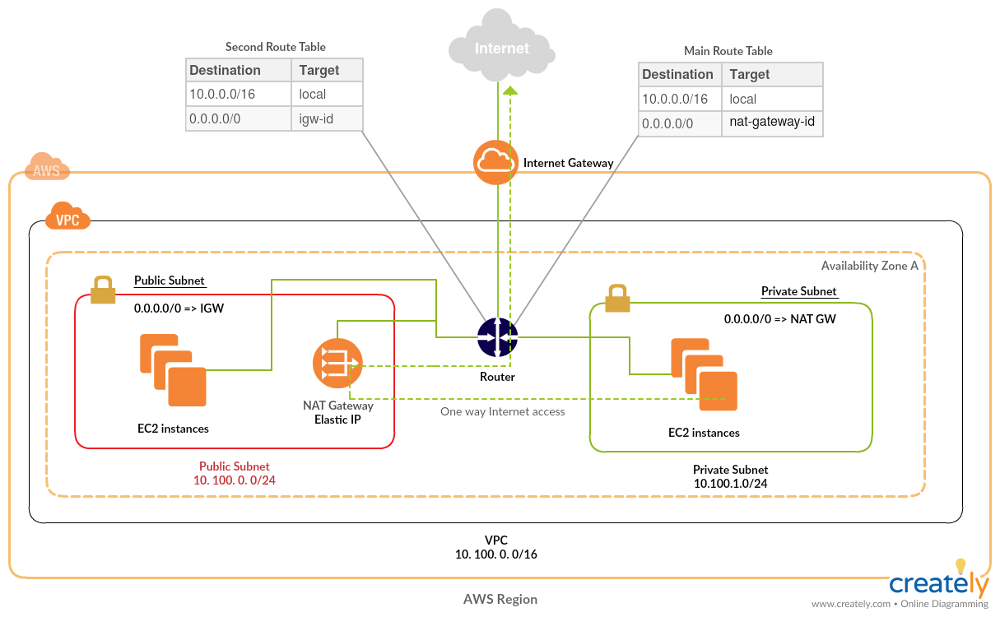

# Terraform configuration to provision new VPC on AWS with one public and one or more private subnets with NAT Gateway

## High Level Overview



## Prerequisites

- git
- terraform (>= 0.12)
- AWS subscription

## How to use

- Get the repo

```
git clone https://github.com/achuchulev/terraform-aws-vpc-natgw.git
cd terraform-aws-vpc-natgw
```

- Create `terraform.tfvars` file

#### Inputs

| Name  |	Description |	Type |  Default |	Required
| ----- | ----------- | ---- |  ------- | --------
| aws_access_key | AWS access key | string | - | yes
| aws_secret_key | AWS secret key | string | - | yes
| aws_region | AWS region | string | "us-east-1" | no
| vpc_cidr_block | VPC subnet CIDR block | string | "10.0.0.0/16" | no
| vpc_subnet_cidr_blocks | VPC subnet CIDR blocks | list | "10.0.0.0/24","10.0.1.0/24" | no
| vpc_tags | VPC subnet CIDR blocks | map  | "" | no
| ssh_port | VPC subnet CIDR blocks | map  | "22" | no
| ssh_cidr | VPC subnet CIDR blocks | map  | "0.0.0.0/0" | no
| icmp_cidr | VPC subnet CIDR blocks | map  | "0.0.0.0/0" | no

- Initialize terraform and plan/apply

```
terraform init
terraform plan
terraform apply
```

- `Terraform apply` will:
  - create new VPC in the specified AWS region
  - create two or more subnets for the VPC
  - allocate one Elastic IP needed for NAT GW
  - create second route table
  - create Internet GW and route for the Public Subnet
  - create NAT GW and route through it to Internet for the Private Subnet(s)
  - assosciate main VPC route table with Private subnet(s)
  - assosciate second VPC route table with Public subnet
  
  
#### Outputs

| Name  |	Description 
| ----- | ----------- 
| vpc_id | The ID of created VPC
| vpc_name | The name of the VPC
| requester_subnet_ids | List VPC Subnet Ids
| azs | List Availability Zones in which Subnet are created
